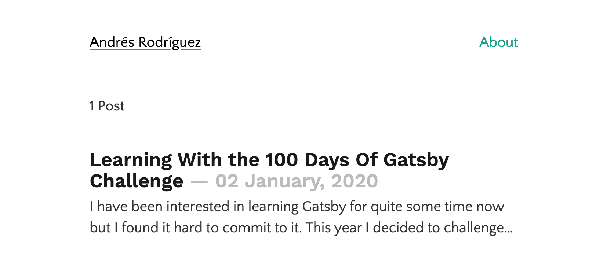

I have been interested in learning Gatsby for quite some time now but I found it hard to commit to it. This year I decided to challenge myself to complete the [100 Days Of Gatsby](https://www.gatsbyjs.org/blog/100days/) coding challenge in order to learn Gatsby from scratch.

And also, there's this:

<blockquote class="twitter-tweet" data-theme="light">
This year I’m going to finally start working on redoing my personal website...  Said this last year and the year before for the last 3 years.
&mdash; Andrés Rodríguez (@andrexish) <a href="https://twitter.com/andrexish/status/1212377346700914688?ref_src=twsrc%5Etfw">January 1, 2020</a></blockquote>

The first challenge involves making [a blog from scratch](https://www.gatsbyjs.org/blog/100days/start-blog/) which means that I will be not only redoing my website using Gatsby but also will use it to document everything I have learned in the process.

I started from the beginner-focused tutorial and even though I know my way around the fundamentals of Gatsby -- like setting up the environment, tooling and React -- it never hurts to recap the basics. The fundamentals section is definitely a solid zero-to-Gatsby experience with a very good read on JSX and some of the core React concepts.

And then I started the part of the tutorials that I was waiting for which was actually building a blog! I learned everything from querying data from different sources, using transformers and programatically add fields to nodes and create pages. It was by far one of the nicest experiences I have ever had when starting to learn something from scratch. This is what I ended up with:

## What's next?

Now that I have a good headstart I am going to keep working on the website. That means working a little bit more on the landing page, write a bio, add social media links and whatever comes next 🔥.
